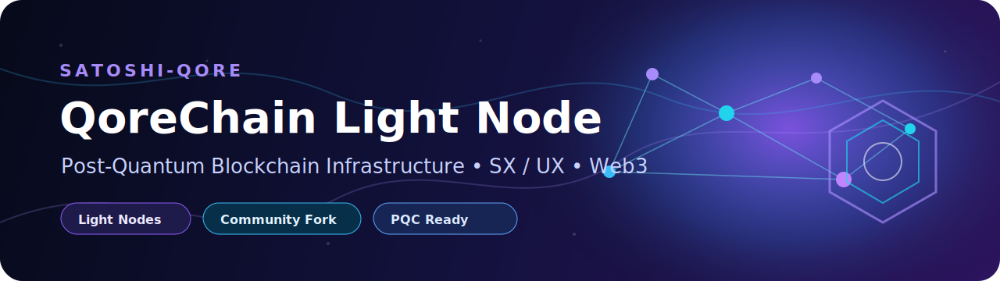

  

# 🐙 QoreChain Light Node

> Community-maintained fork by **Satoshi-Qore** for exploring, running, and supporting QoreChain light node infrastructure.

---

## 🚀 Overview

QoreChain Light Node is a lightweight client for the QoreChain network.

It is designed for users who want to contribute to network infrastructure without running a full validator. A light node can relay traffic, serve light client queries, contribute uptime, and participate in the QoreChain ecosystem.

This fork is focused on:

- Helping new users understand light node setup
- Testing the SX and UX editions
- Documenting community installation steps
- Supporting QoreChain node operators
- Tracking useful commands and troubleshooting notes

---

## 🧩 Editions

QoreChain Light Node provides two editions:

| Edition | Name | Best For |
|---|---|---|
| **SX** | Server eXperience | VPS / server deployments |
| **UX** | User eXperience | Dashboard-based desktop or web use |

---

## ✨ Key Features

- Header verification via skipping verification light client
- Delegated staking with multi-validator split
- Auto-compound rewards with configurable intervals
- Reputation-aware validator rebalancing
- Real-time network telemetry
- On-chain registration with heartbeat liveness proofs
- 3% block reward eligibility for active light nodes
- Post-quantum cryptography support
- Interactive onboarding wizard
- Local-only mode for pre-mainnet testing
- Live PQC self-test command

---